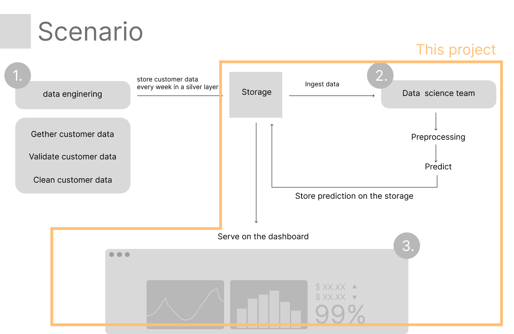
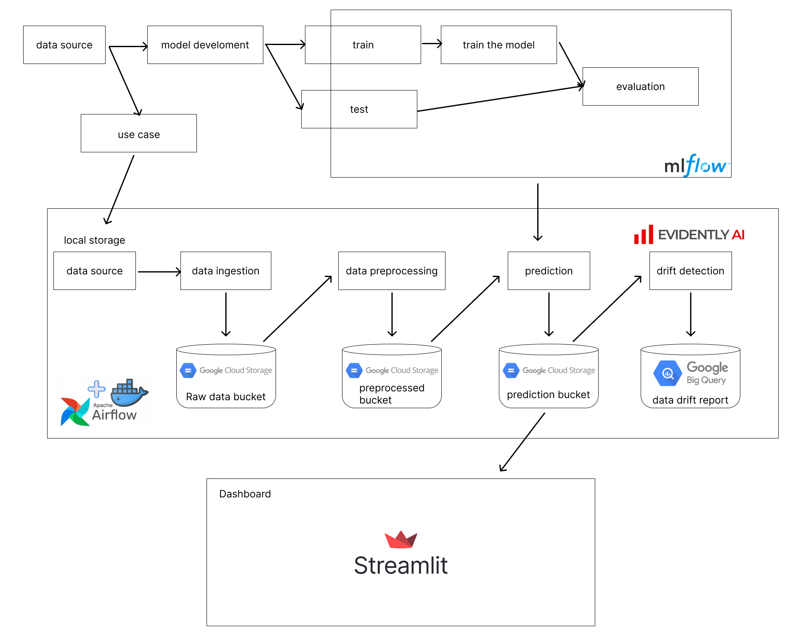

# Churn customer end-to-end
This repo is designed to simulate machine learning use cases in detecting churn customers that include processes such as
1. model development and model tracking using mlflow
2. data ingestion into Google Cloud storage bucket
3. data transformation
4. churn prediction
5. data drift prediction using evidently
6. orchestration using airflow
---
## kscenario
This project assumes that :
1. we are a data science team
2. receive customer data every certain period from the data engineer
3. we need to do :
  a. preprocess the data so that our data can be used to make a prediction

  b. make predictions about churn customer

  c. check the data drift to ensure our model is still reliable

  d. present the result in dashboard

  
---
## Tools used
1. mlflow
2. apache airflow
3. docker
4. big query
5. Google Cloud storage bucket
6. evidently
7. streamlit
8. seaborn
---
## Workflow

